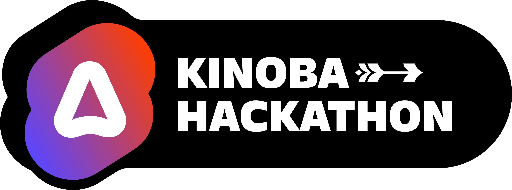

# roast-my-ui - Kinoba Hackathon

*Developed in 1 week during the Svelte x AdonisJS Kinoba hackathon I organized from June 10th to June 14th 2024*



## Tech stack
- Backend: 
  
  

- Frontend: 
    

- Tools: 
 

## Requirements

- Node >= 21
- typescript
- postgresql

- Bun: https://bun.sh/
```bash
brew tap oven-sh/bun
brew install bun
```

- Foreman: https://github.com/ddollar/foreman
```bash
gem install foreman
```

## Development

- **(ℹ️ only for first setup)** Create manually your DB via psql or TablePlus  
  - Open psql console: `psql postgres`
  - Create DB: `CREATE DATABASE db_name;`
  - Grant privileges to your DB: `GRANT ALL PRIVILEGES ON DATABASE db_name TO developer;`
- Run `./scripts/reset-db` to setup database and seed
- Run `./scripts/dev` to start development server
